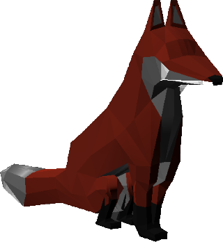
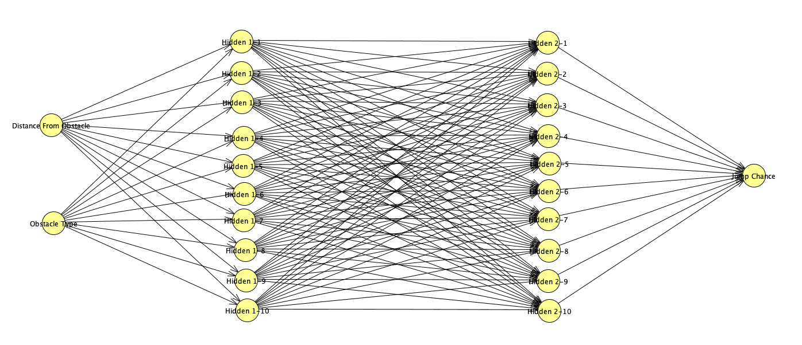
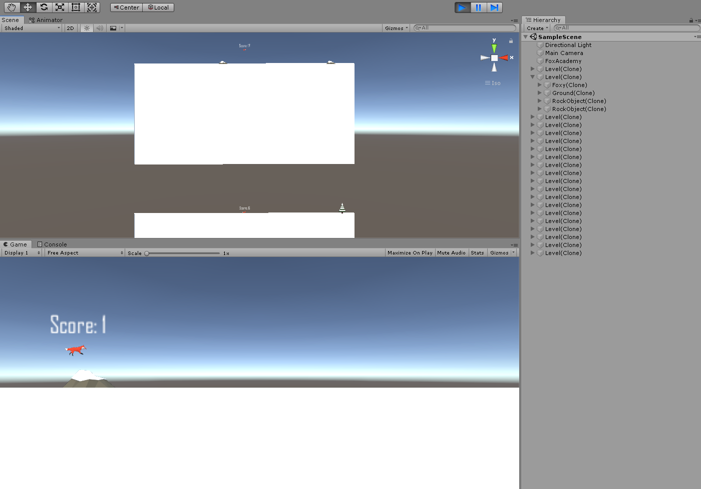
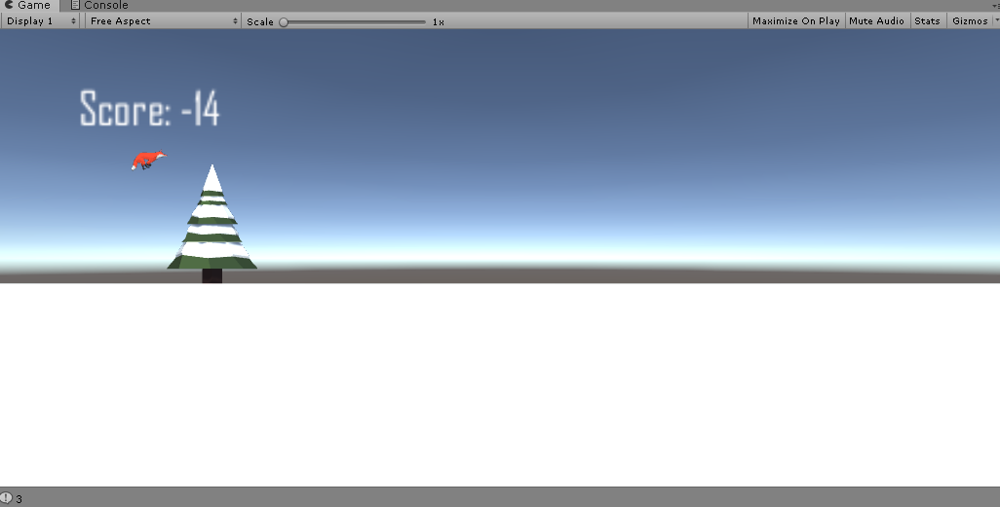
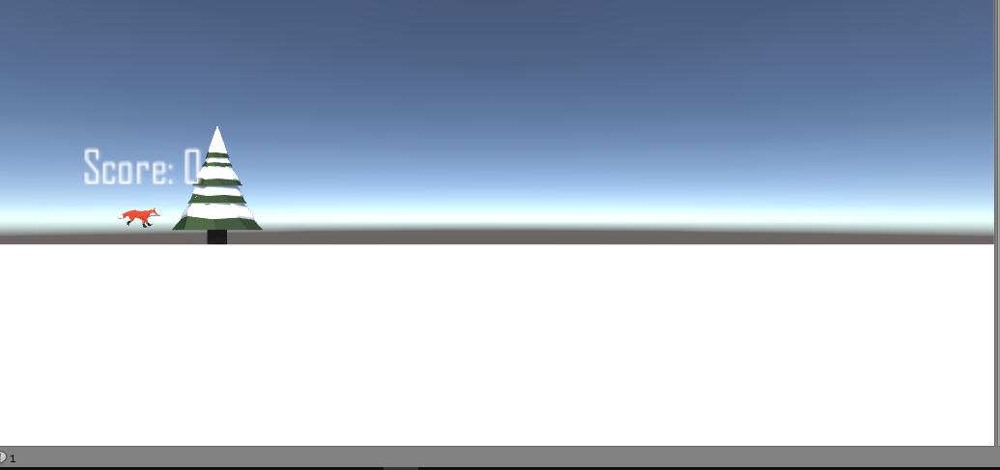
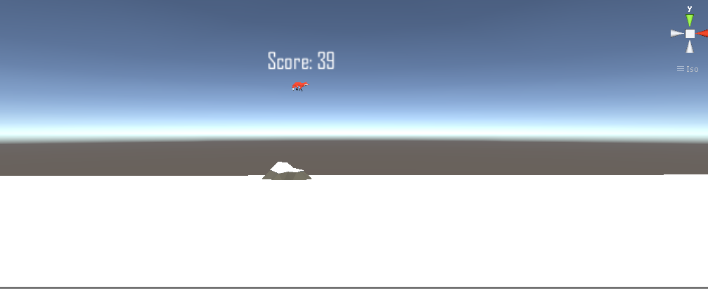

# Fox Run - Self Thaught AI

Fox Run is a game demo which uses AI to teach itself how to
get as many points as possible in game by using method of
reinforcement learning.
The game is designed and programmed in Unity using
C# programming language.
The game's mechanics is based on well known Google Chrome's game
"T-Rex Run".
In order the game plays itself successfully, the AI needs to control
the games main hero (Foxy) to jump at the right time and just enough high
to avoid running into obstacles.
For every successfully avoided obstacle (successfully jumped over it),
Foxy get 1 point for reward.
Otherwise, Foxy get punished by taking away 3 points.

Foxy, the main hero of this project :-)

## Used tools, technologies, and other existing solutions

This problem has been solved several times mostly using Python, using the
TensorFlow framework.
There are also solutions on the Internet programming language JavaScript
with the Node.js library.
However, this project aims to implement custom reinforcement learning
neural network model in C# to be natively used with Unity game engine,
along its feature rich game making capabilities.

## Idea of the problem solution

The idea of the problem solution is to design a neural network that would
be suitable for successfully overcoming obstacles in the game.
To make the training as successful and efficient as possible, multiple
individuals of Foxy the fox would be used, who would independently of each
other simultaneously train for a period of time to jump over obstacles.
After the expiration of the time period, a selection would be simulated,
in which the first half of the more successful individuals would “transfer”
their neural network to the other half of the less successful individuals,
who would in that case “inherit” the characteristics of the more successful
individuals.
The measure of success of each neural network is the number of points that
the foxes achieve by jumping over obstacles.
Each following generation would then be more successful than the previous one.
Also, when evolving from one generation to another, random “mutations” occur
over individuals, which tend to improve the neural network, but also worsen
it.
This algorithm is called a genetic algorithm and is inspired by natural
selection and mutations in the biological world.

## Foxy's neural network model design

When designing the topology of the neural network, simplicity and good
enough performance were considered first.
The neural network consists of one input layer with two neurons, two hidden
layers, both of ten neurons, and an output layer with one neuron.
The input layer simulates the perception of sight.
Input layer gives Foxy ability to detect an obstacle, and determine how
far it is from the obstacle, he can also determine how big the obstacle is.
The distance and the size of the obstacle are solved by two neurons, placed
in the input layer of the network, and the data is forwarded to the hidden
layers.
The hidden layers are left to Foxy to optimize its internal mind connections
to be as best as possibe in jumping over obstacles.
From the hidden layers to the output layer comes the data that represents
Foxy's final decision how high he needs to jump, or if he needs to jump at
all.
The output neuron can take values from -1 to 1
(due to the use of the *tanh* activation function).
If the value of the output layer is less than or equal to 0, Foxy will not
jump, otherwise, Foxy will jump as high as defined by the magnitude of
output neuron.

A model of the Foxy neural network.
Neural network tries to mimic the fox brain.

## Foxy's neural network implementation

The model of the neural network can be implemented in C# using tensors, or
a three-dimensional array of float type.
Using tensors, it is possible to describe each weight of each neuron within
each layer of the neural network.
Therefore, the first dimension of the tensor describes the layers of the
neural network, and there are three of them
(not four, because the input layer is not affected by the weights).
The second dimension represents the neurons in each layer, which are not
the same number.
To save memory, the neurons within each layer are dynamically allocated
(2D jagged array) and their number varies in each layer.
The third dimension represents the weights of the neurons of the previous
layer that play a major role in adjusting the network of the neural network
for performing tasks.
Since the number of neurons is not equal in the layers, it means that the
number of weights will also vary.
To save memory, the weights are also dynamically allocated
(i.e. 3D jagged array, because the tensor does not have the same dimensions
everywhere).

### Foxy's neural network behavior

The network works on the feed forward principle.
The data that Foxy collects from his environment are forwarded to his
neural network in real time, and are multiplied by the weights of each
neuron they pass through.
Each neuron computes some value, and the neurons in the output layer
represent the final decision on the jump.
To normalize the values that pass through the neural network to a certain
interval, an activation function is applied to these data.
As mentioned, the activation function used in this project is the **hyperbolic
tangent, tanh**.

## Training environment implementation

The neural network itself is not enough, if there is no environment, nor
the fox object, which would feed forward the data from the environment
to its neural network.
Also, in order for selection and genetic algorithm to make sense, it is
necessary to have more individuals of foxes, who would independently of each
other jump over each their own obstacles.
Therefore, four classes are defined in Unity Engine: *FoxAcademy*, *Level*,
*Fox*, and *FoxBrain*.
The FoxBrain class contains the implementation of the neural network.
The Fox class represents the fox as organism, which can interact with the
game environment.
Each fox has its own neural network (i.e. *FoxBrain*) which
foxes use to make jumping decisions, and to learn and envolve,
indenpendently of other foxes.
Also, the *Fox* class contains a visual 3D model of the fox for visual
representation in the game.
The *Level* class represents the environment in which the fox is located.
Each environment has exactly one fox, and independently of each other
randomly generates obstacles that the foxes have to overcome.
Each obstacle created by the *Level* class has its own trigger that
triggers if the fox ran into an obstacle and punishes the fox by taking
away 3 points.
Finally, the *FoxAcademy* class manages the *Level* objects, as well as
the foxes in each level, and simulates the selection and mutation of the
foxes after each epoch of training.
That means the FoxAcademy object performs the genetic algorithm.

Foxy training example.
In the upper window 2 levels and 2 foxes (2 Foxy instances) can be seen.
The foxes are teaching themselves to jump over obstacles.

## Results

When releasing foxes to train, foxes will jump randomly and will often
run into obstacles which can drastically reduce their scored points.
Therefore, in the first generation, the vast majority of foxes will at
the very beginning have negative points, those that have positive points
they are indispensable individuals who will pass on their skills
(i.e. genes) to the next generations.
However, the positive points of the early generations do not guarantee
good skill in jumping obstacles.
The training process is relatively slow, and it takes about ten generations
to make Foxes achieve good results.
After that, most Foxes have positive points, and more successful
individuals have dozens of points.

An example of the average success of Foxy in the early generations of
training.
It's obvious from the picture that Foxy didn't jump high enough,
resulting in an imminent running into an obstacle.

An example of a relatively successful Foxy in the early generations.
Although it will the result ensure the transfer of skills to other foxes,
this does not mean that Foxy stays successful.
From the picture it is obvious, despite the result, that Foxy has not
yet learned to jump over obstacle.

An example of a more gifted Foxy in the 14th generation.
Foxy successfully skips over the stone, albeit a little high,
but still succeeds.
